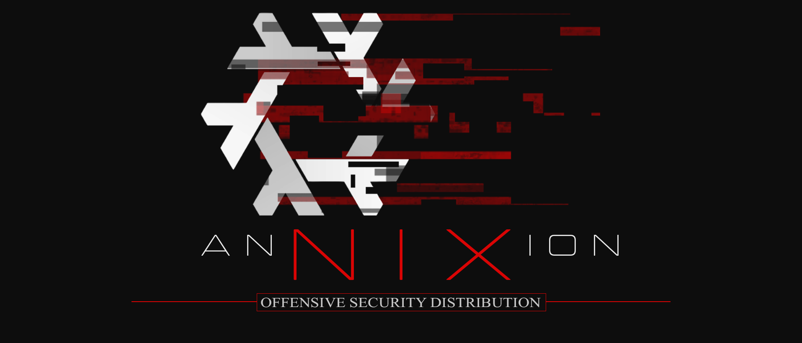

# AnNIXion



> A declarative, reproducible offensive security distribution built on NixOS — for operators who treat their environment as infrastructure.

---

## Overview

AnNIXion is a NixOS-based security distribution designed for two audiences:

- **Red teamers** — penetration testing, exploitation, network analysis, proxy interception
- **OSINT & intelligence practitioners** — source gathering, identity compartmentalization, fingerprint evasion

The entire system — tools, desktop, configuration, user environment — is declared in code. No manual setup. No configuration drift. No "works on my machine."

---

## Why AnNIXion

Most security distributions are curated package lists on top of a general-purpose OS. You get the tools, but not the environment. Configuration drifts. Reinstalls diverge. What ran on your last machine may not run on this one.

AnNIXion is different in kind, not just degree. The name comes from *annexion* — to take full control of a territory, absorb it completely, make it yours. That is the operating principle.

| Property | What it means in practice |
|---|---|
| Your environment is code | The entire system — tools, desktop, shell, shortcuts — lives in text files you own and version |
| No drift | Two operators deploying the same config get the same machine. No exceptions. |
| Reversible by default | Every change is a new generation. Break something, boot the previous state in seconds. |
| Composable layers | RedTeam, OSINT, and Privacy tooling are separate modules. Load what the operation requires. |
| Auditable supply chain | Pinned dependencies, lockfile-tracked. You know exactly what is running and where it came from. |

You do not configure AnNIXion. You declare it — and it becomes exactly what you declared.

---

## Current State

AnNIXion is in active development. The following is implemented and functional:

- NixOS flake with Home Manager and plasma-manager integration
- Modular config structure — desktop, xrdp, shell, and security tools each in their own module
- KDE Plasma 6 desktop (X11) with Krohnkite tiling and Breeze Dark theme
- Hyper-V Enhanced Session over vsock (xrdp)
- Offensive, OSINT, and SDR tooling declared in `modules/security-tools.nix`
- ZSH + tmux + xterm terminal environment
- User override system — drop personal settings into `user/` without touching base config

The following is planned and tracked in [ROADMAP.md](ROADMAP.md):

- Custom TUI installer
- Firefox dual-profile setup (RedTeam / OSINT)
- Full tool layer separation (RedTeam, OSINT, Privacy) as selectable profiles
- Kernel hardening and MAC randomization
- ISO build pipeline

---

## Installation

> ⚠️ No automated installer yet. Manual setup required.

**Prerequisites:** A NixOS installation with flakes enabled.

```nix
# /etc/nixos/configuration.nix  (your current NixOS install, before deploying AnNIXion)
nix.settings.experimental-features = [ "nix-command" "flakes" ];
```

**Deploy:**

```bash
git clone https://github.com/Pyth3rEx/AnNIXion ~/.dotfiles
cd ~/.dotfiles

# Copy over your hardware config
cp /etc/nixos/hardware-configuration.nix ./hardware-configuration.nix

# Update flake inputs
nix flake update

# Apply system + user config in one shot
sudo nixos-rebuild switch --flake .#AnNIXion --impure
```

**Hyper-V users:** Enhanced Session requires vsock support. Run this on the Windows host before connecting:

```powershell
Set-VM -VMName "AnNIXion" -EnhancedSessionTransportType HvSocket
Set-VMHost -EnableEnhancedSessionMode $true
```

Then fully shut down the VM and reconnect from Hyper-V Manager.

---

## Repository Structure

```
.
├── flake.nix                    # Inputs, module wiring, conditional user imports
├── hardware-configuration.nix   # Auto-generated — do not edit manually
├── home.nix                     # Base user environment: shell, dev tools, KDE config
├── modules/
│   ├── desktop.nix              # KDE Plasma 6, SDDM, X11, Firefox
│   ├── xrdp.nix                 # Hyper-V Enhanced Session via vsock
│   ├── shell.nix                # System-wide zsh, login shell, xterm
│   └── security-tools.nix      # Offensive, OSINT, and SDR packages
└── user/                        # Your personal overrides — never committed upstream
    ├── configuration.nix        # System-level overrides (hostname, timezone, groups…)
    ├── home.nix                 # User-environment overrides (git, aliases, packages…)
    ├── examples/
    │   ├── git.nix              # Example: git identity and signing config
    │   └── zsh.nix              # Example: welcome banner and recon aliases
    └── README.md                # How the override system works
```

---

## Planned Features

### Installer
- Custom TUI installer (`whiptail`) — no GUI required
- Full disk encryption via LUKS2 with `disko`
- Random Windows-style hostname at install time (e.g. `DESKTOP-K4MXR2J`)
- Profile selection: RedTeam, OSINT, or both

### Firefox — Two Profiles, Two Identities

**RedTeam profile** — speed and visibility over discretion
- Burp Suite proxy pre-configured (127.0.0.1:8080)
- Extensions: FoxyProxy, Wappalyzer, HackTools

**OSINT profile** — fingerprint evasion first
- Canvas Blocker, ResistFingerprinting, Multi-Account Containers
- Extensions: uBlock Origin, Cookie AutoDelete, User-Agent Switcher
- SOCKS5/VPN-aware, per-container JavaScript control

### Tool Layers
- **RedTeam**: nmap, metasploit, burpsuite, sqlmap, gobuster, evil-winrm, impacket, crackmapexec
- **OSINT**: theHarvester, maltego, spiderfoot, sherlock, holehe, recon-ng, ExifTool
- **Privacy**: Tor, Proxychains-ng, Mullvad, ProtonVPN, MAC randomization

### Hardening
- Kernel hardening parameters (sysctl)
- MAC address randomization on all interfaces
- Minimal running services by default

---

> For authorized security testing, research, and educational use only.
> Obtain explicit written permission before conducting any assessment.
