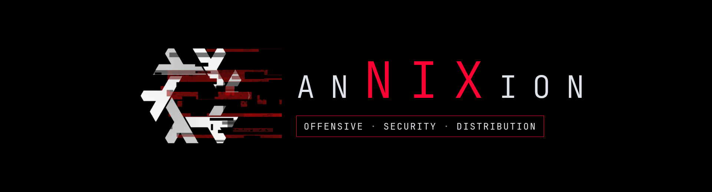

<div align="center">

# AnNIXion



**The environment for operators who refuse to wing it.**

[](https://github.com/Pyth3rEx/AnNIXion/releases/latest)
[](https://github.com/Pyth3rEx/AnNIXion/releases)
[](https://github.com/Pyth3rEx/AnNIXion/stargazers)
[](https://github.com/Pyth3rEx/AnNIXion/actions/workflows/ci.yml)
[](LICENSE)
<br>
[](https://nixos.org)
[](https://nixos.wiki/wiki/Flakes)
[](https://github.com/Pyth3rEx/AnNIXion)
<br>
[](https://github.com/Pyth3rEx/AnNIXion/commits/main)
[](https://github.com/Pyth3rEx/AnNIXion/graphs/commit-activity)
[](https://github.com/Pyth3rEx/AnNIXion/issues)
[](https://github.com/Pyth3rEx/AnNIXion/pulls)

[**Installation**](docs/installation.md) · [**Usage**](docs/usage.md) · [**Customization**](docs/customization.md) · [**Roadmap**](docs/roadmap.md)

</div>

---

AnNIXion is a NixOS-based offensive security distribution for red teamers, OSINT
practitioners and persona operators. Every tool, browser profile, proxy rule and
desktop shortcut is declared in code — version-controlled, reproducible, deployed
in a single command.

The name comes from *annexion* — to take full control of a territory, absorb it
completely, make it yours.

---

## Quick start

**Fresh install — no NixOS required:**

1. Download the latest ISO from [Releases](https://github.com/Pyth3rEx/AnNIXion/releases/latest)
2. Flash to USB with [Rufus](https://rufus.ie) (Windows) or `dd` (Linux/macOS)
3. Boot — it auto-logs in as `operator`
4. Connect with `nmtui`, then run `annixion-install`

**On existing NixOS:**

```bash
git clone https://github.com/Pyth3rEx/AnNIXion ~/.dotfiles
cp /etc/nixos/hardware-configuration.nix ~/.dotfiles/
git -C ~/.dotfiles add hardware-configuration.nix -f
sudo nixos-rebuild switch --flake ~/.dotfiles#AnNIXion --impure
```

After the first build, `rebuild`, `upgrade` and `update` are available from the
shell. Full guide, including Hyper-V Enhanced Session:
[docs/installation.md](docs/installation.md).

---

## What makes it different

- **The killswitch is in the kernel, not the browser.** OSINT and Puppet Master
  run in a systemd slice, and an nftables rule on that cgroup permits egress only
  through a live tunnel — so WebRTC, OCSP and captive-portal probes are covered
  too, and traffic stops if the tunnel drops.
- **Four Firefox profiles that cannot bleed into each other.** Separate cookies,
  cache, extensions and egress path, generated from configuration. Burp's CA is
  fetched and trusted on first install.
- **One flake, one command.** Redeploying is the same command as deploying, and
  a bad change is undone by booting the previous generation.
- **A tool is one file.** Its package, menu entry and icon live together in
  [`catalog/`](catalog/), so they cannot drift apart.

---

## Documentation

| | |
|---|---|
| [Installation](docs/installation.md) | Prerequisites, deploy steps, Hyper-V setup |
| [Architecture](docs/architecture.md) | How the tree is laid out, and how to add a tool |
| [Usage](docs/usage.md) | Commands, browser profiles, Burp and VPN setup |
| [Customization](docs/customization.md) | The user override system, adding tools, dev environment |
| [Shell reference](docs/zsh.md) | Prompt, keybindings, aliases and plugins |
| [CLI tools](docs/tools.md) | The enhanced command-line toolset |
| [Hardening](docs/hardening.md) | What is disabled to reduce attack surface, and how to restore it |
| [Visual identity](docs/visual-identity.md) | Palette, typography, the mark system |
| [Developer guide](docs/dev.md) · [Testing](docs/testing.md) | Local CI levels · the suite and the rule behind it |
| [FAQ](docs/faq.md) · [Roadmap](docs/roadmap.md) | Troubleshooting · phase-by-phase progress |
| [Contributing](CONTRIBUTING.md) · [Security](SECURITY.md) | How to contribute · posture and reporting |

---

## Status

Active development, deployable today. Shipping **0.3.1 "Tripwire"**; next is
**0.4.0 "Nebula"**. Full disk encryption, a TUI installer and kernel hardening
are the notable gaps — see [docs/roadmap.md](docs/roadmap.md).

---

<div align="center">

**For authorized security testing, research and educational use only.**
Obtain explicit written permission before any assessment. The authors assume no
liability for misuse.

</div>
