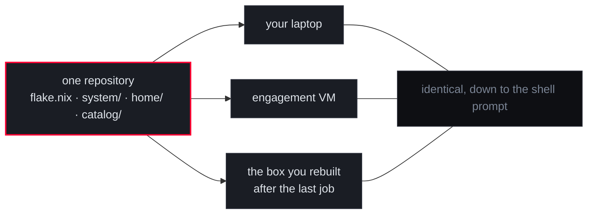
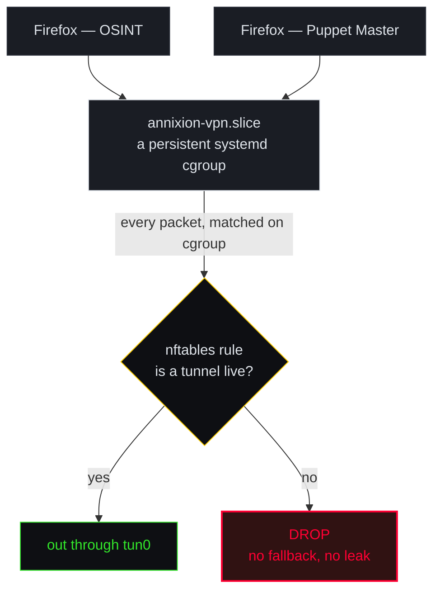
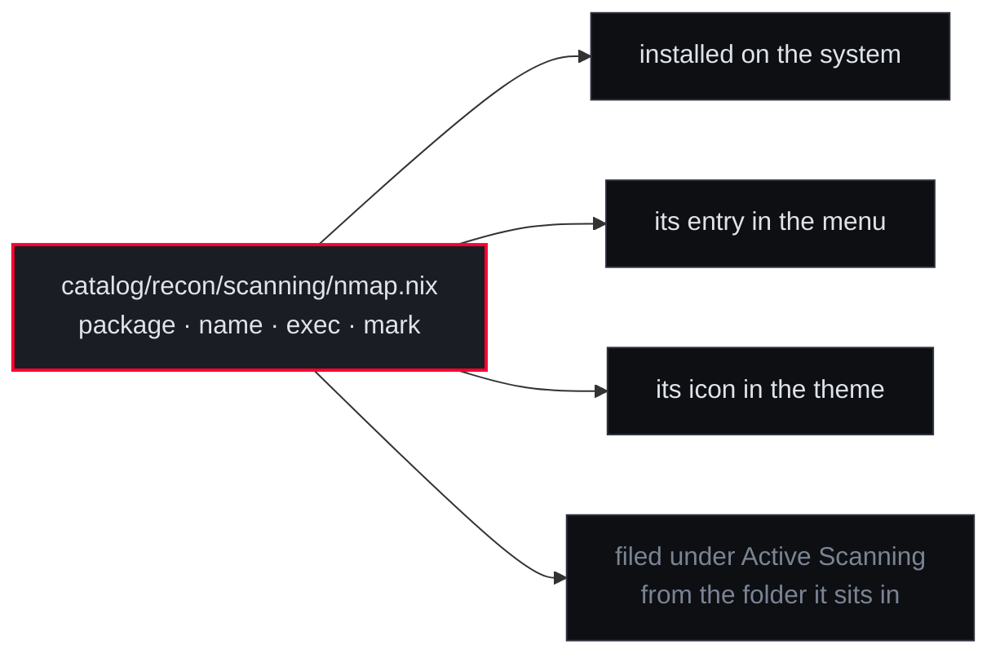

<div align="center">

# AnNIXion


**The environment for operators who refuse to wing it.**

[](https://github.com/Pyth3rEx/AnNIXion/releases/latest)
[](https://github.com/Pyth3rEx/AnNIXion/releases)
[](https://github.com/Pyth3rEx/AnNIXion/stargazers)
[](https://github.com/Pyth3rEx/AnNIXion/actions/workflows/ci.yml)
[](LICENSE)
<br>
[](https://nixos.org)
[](https://nixos.wiki/wiki/Flakes)
[](https://github.com/Pyth3rEx/AnNIXion)
<br>
[](https://github.com/Pyth3rEx/AnNIXion/commits/main)
[](https://github.com/Pyth3rEx/AnNIXion/graphs/commit-activity)
[](https://github.com/Pyth3rEx/AnNIXion/issues)
[](https://github.com/Pyth3rEx/AnNIXion/pulls)

[**Installation**](docs/installation.md) · [**Usage**](docs/usage.md) · [**Customization**](docs/customization.md) · [**Roadmap**](docs/roadmap.md)

</div>

---

AnNIXion is an offensive security distribution built on NixOS, for red teamers,
OSINT work and persona operations.

The tools, the four browser profiles, the proxy rules, the firewall policy, the
menu, the keyboard shortcuts and the wallpaper are all declared in files in this
repository. That is the whole system. There is no other state, nothing
configured by hand at 2am that only you remember, and no drift between the box
you built in March and the one you build today.

---

## Annexing the system

*Annexion* — to take full control of a territory, absorb it completely, make it
yours.

The barrier is real and worth stating plainly. On NixOS you do not install
software, you declare it; a package that is not written down is not on the
machine, and no amount of `apt install` will change that. The first week is
spent learning where things go. People bounce off it.

What is on the other side of that wall:

| What you get | Why it matters |
|---|---|
| **Nothing drifts** | The config *is* the system. A box six months old and one built this morning from the same commit are the same box. |
| **Rollback is a reboot** | A change that breaks the desktop is undone by booting the previous generation. Nothing to uninstall, nothing to repair. |
| **Your setup is portable** | New laptop, fresh VM, rebuilt after an engagement: one clone and one command. |
| **You can answer "what is on it"** | Every release ships a bill of materials. You will be asked this eventually. |


```mermaid
flowchart LR
    R["one repository<br/>flake.nix · system/ · home/ · catalog/"]
    R --> L["your laptop"]
    R --> V["engagement VM"]
    R --> B["the box you rebuilt<br/>after the last job"]
    L --- N["identical, down to the shell prompt"]
    V --- N
    B --- N
    style R fill:#1A1D24,stroke:#FF0033,stroke-width:2px,color:#DFE4EA
    style N fill:#0E0F13,stroke:#2E323D,color:#7A8494
    style L fill:#1A1D24,stroke:#2E323D,color:#DFE4EA
    style V fill:#1A1D24,stroke:#2E323D,color:#DFE4EA
    style B fill:#1A1D24,stroke:#2E323D,color:#DFE4EA
```

AnNIXion is that climb already made for offensive security. The tooling, the
browser isolation, the egress rules and the desktop are configured and working
the first time you boot it. What you add after that is yours.

---

## Egress that fails closed

A VPN that drops mid-engagement is not an inconvenience. The usual answers are
weak in specific ways: a proxy set in browser preferences does not cover WebRTC
or OCSP, and a killswitch in a VPN client is machine-wide, which is useless when
one browser must reach the client's LAN and another must never touch it.

So the enforcement is a cgroup and an nftables rule, and the browser is not
consulted:


```mermaid
flowchart TD
    O["Firefox — OSINT"] --> S
    P["Firefox — Puppet Master"] --> S
    S["annixion-vpn.slice<br/>a persistent systemd cgroup"]
    S -->|every packet, matched on cgroup| N{"nftables rule<br/>is a tunnel live?"}
    N -->|yes| T["out through tun0"]
    N -->|no| D["DROP<br/>no fallback, no leak"]
    style O fill:#1A1D24,stroke:#2E323D,color:#DFE4EA
    style P fill:#1A1D24,stroke:#2E323D,color:#DFE4EA
    style S fill:#1A1D24,stroke:#DFE4EA,color:#DFE4EA
    style N fill:#0E0F13,stroke:#FFD000,color:#DFE4EA
    style T fill:#0E0F13,stroke:#33E62B,color:#33E62B
    style D fill:#301212,stroke:#FF0033,stroke-width:2px,color:#FF0033
```

WebRTC, OCSP, captive-portal probes and anything else the browser does without
telling you are all covered, because none of it can leave the cgroup. When the
tunnel dies, traffic stops rather than quietly continuing from your real
address.

Red Team is deliberately *not* confined — it has to reach the LAN as often as
the internet — but it still fails closed on Burp, and one command puts it in
the tunnel when the engagement calls for it.

---

## Four browsers that cannot contaminate each other

Not four windows, and not four container tabs. Four profiles, each with its own
cookies, cache, extensions, search engines and route out of the machine.

| Profile | Route out | Built for |
|---|---|---|
| **Red Team** | Burp at `127.0.0.1:8080`, fails closed | Web assessment, interception |
| **OSINT** | VPN tunnel, kernel-enforced | Investigation, NoScript, canvas and UA control |
| **Puppet Master** | VPN tunnel, kernel-enforced | Personas, multi-account containers, per-container stripe |
| **Unsafe Browser** | Direct, no proxy | Captive portals, and nothing else |

Burp's CA is fetched and installed through Firefox enterprise policy on first
run, so interception works immediately instead of after the usual certificate
dance.

---

## A menu shaped like the work

Ninety binaries under a single "Security" folder is not a menu, it is a list.
This one is the kill chain:

```
AnNIXion
├── 01. Reconnaissance
│   ├── Passive OSINT        theHarvester · Whois · dig · SecLists
│   ├── Active Scanning      Nmap · WhatWeb · Gobuster · ffuf
│   └── RF / Signal Intel    HackRF · Gqrx · GNU Radio
├── 02. Weaponization        Ghidra · Binwalk
├── 03. Delivery             Burp Suite · sqlmap
├── 04. Exploitation
│   ├── Frameworks           Metasploit
│   ├── Credential Attacks   Hydra · John the Ripper · Hashcat
│   └── Wireless             Aircrack-ng
├── 05. Installation         Netcat
├── 06. C2                   Metasploit
├── 07. Post-Exploitation    Impacket
├── 08. Forensics            Volatility 3 · Autopsy
├── 09. Reverse Engineering  Ghidra · Binwalk
└── 10. Sniffing & Analysis  Wireshark · Netcat
```

Every icon is drawn for this system rather than pulled from a pack, and the
colour of a mark tells you what running that tool does to a target — green for
passive, amber for probing, red for offensive, blue for forensic. You can read
the menu without reading the labels.

The menu is not maintained by hand. A tool is one file, and the package list,
the desktop entry, the menu tree and the icon are all derived from it:


```mermaid
flowchart LR
    F["catalog/recon/scanning/nmap.nix<br/>package · name · exec · mark"]
    F --> P["installed on the system"]
    F --> D["its entry in the menu"]
    F --> M["its icon in the theme"]
    F --> C["filed under Active Scanning<br/>from the folder it sits in"]
    style F fill:#1A1D24,stroke:#FF0033,stroke-width:2px,color:#DFE4EA
    style P fill:#0E0F13,stroke:#2E323D,color:#DFE4EA
    style D fill:#0E0F13,stroke:#2E323D,color:#DFE4EA
    style M fill:#0E0F13,stroke:#2E323D,color:#DFE4EA
    style C fill:#0E0F13,stroke:#2E323D,color:#7A8494
```

Adding a tool is adding that one file. Nothing registers it anywhere, so a tool
cannot end up installed but missing from the menu, or drawn but never shipped.

---

## A system that can account for itself

Most distributions ask you to trust them. Every AnNIXion release publishes what
is actually inside it:

- a CycloneDX SBOM of the **installed** closure — every package and version on a
  running machine
- a second covering the **build** closure — the toolchains, sources and patches
  that produced it
- a readable page rendering both
- `SHA256SUMS` over all of it and the ISO

The two closures are published and counted separately on purpose. A CVE against
a compiler that built the image is not running on your machine, is not reachable
by an attacker, and treating it as exposure turns a security document into
noise.

Point your own scanner at the first one — `grype sbom:annixion-<version>.cdx.json`.
None of this is a verdict. It is the material for you to reach one.

A weekly scan republishes the current state, so you can also just look:

| Page | What it tells you |
|---|---|
| [Known CVEs](docs/security/cves.md) | What is reported against the shipped system now, and what has no upstream fix |
| [Packages](docs/security/packages.md) | Every package on a running machine, with versions |
| [Applications](docs/security/apps.md) | The tools this distribution chose to ship, and where they stand |

A pull request that pulls in a new dependency with a known CVE is told so on the
pull request, scoped to what that branch adds rather than re-reporting the whole
closure.

---

## The desktop

KDE Plasma 6 on X11 with Krohnkite tiling. Hyper-V Enhanced Session over vsock,
so it is usable as a guest rather than merely bootable. ZSH with oh-my-posh, fzf
history and syntax highlighting. Docker runs rootless, as you, with no `docker`
group — that group is root by another name.

Attack surface reduction is on by default: OpenSSH, ModemManager, geoclue, fwupd
and the KDE PIM stack are gone, the firewall has no open ports, and a set of
kernel sysctls is applied. All of it at priority 900, so any single piece is
restored with one line.

---

## Making it yours

Every option in the base config ships as a default, which means anything you put
in `user/` wins without `lib.mkForce` and without editing a tracked file:

```nix
# user/configuration.nix
networking.hostName = "raven";
time.timeZone = "America/New_York";
environment.systemPackages = with pkgs; [ tcpdump ];
```

Hostname, git identity, extra packages, keyboard shortcuts, or switching parts
of the hardening back on. `user/` is yours; upstream never touches it.

---

## Install

**From the ISO**, if you do not already run NixOS:

1. Download the [latest release](https://github.com/Pyth3rEx/AnNIXion/releases/latest)
2. Flash it with [Rufus](https://rufus.ie) or `dd`
3. Boot — it logs in automatically as `operator`
4. Connect with `nmtui`, then run `annixion-install`

**On a machine already running NixOS:**

```bash
git clone https://github.com/Pyth3rEx/AnNIXion ~/.dotfiles
cp /etc/nixos/hardware-configuration.nix ~/.dotfiles/
git -C ~/.dotfiles add hardware-configuration.nix -f
sudo nixos-rebuild switch --flake ~/.dotfiles#AnNIXion --impure
```

The toolset is large — allow 30–60 minutes on a slow connection. After the first
build, `rebuild`, `upgrade` and `update` handle the rest.

Hyper-V setup and the full walkthrough:
**[docs/installation.md](docs/installation.md)**

---

## Documentation

| Guide | What it covers |
|---|---|
| [Installation](docs/installation.md) | Prerequisites, deploy steps, Hyper-V Enhanced Session |
| [Usage](docs/usage.md) | The `annixion-*` commands, browser profiles, Burp and VPN setup |
| [Customization](docs/customization.md) | The override system, adding tools, the dev environment |
| [Architecture](docs/architecture.md) | Repository layout, the tool catalog, how to add a tool |
| [Shell reference](docs/zsh.md) | Prompt, keybindings, aliases, plugins |
| [CLI tools](docs/tools.md) | bat, ripgrep, fd, fzf, jq and the rest |
| [Hardening](docs/hardening.md) | What is disabled, what is deliberately left alone, how to restore it |
| [Visual identity](docs/visual-identity.md) | Palette, typography, the mark system |
| [Developer guide](docs/dev.md) | Local CI levels and the contributor workflow |
| [Testing](docs/testing.md) | The suite, and the rule that every feature ships with its tests |
| [FAQ](docs/faq.md) | Install, boot, browser, proxy and CI troubleshooting |
| [Roadmap](docs/roadmap.md) | What is done, and what is planned |
| [Security](SECURITY.md) | Posture, the bill of materials, reporting a vulnerability |
| [Contributing](CONTRIBUTING.md) | Branch model, conventions, what to run before a PR |

---

<div align="center">

Built on NixOS and proud of the lineage. Not affiliated with, endorsed by or
connected to the NixOS Foundation or the Nix project.

**For authorized security testing, research and educational use only.**
Obtain explicit written permission before any assessment.
The authors assume no liability for misuse.

</div>
