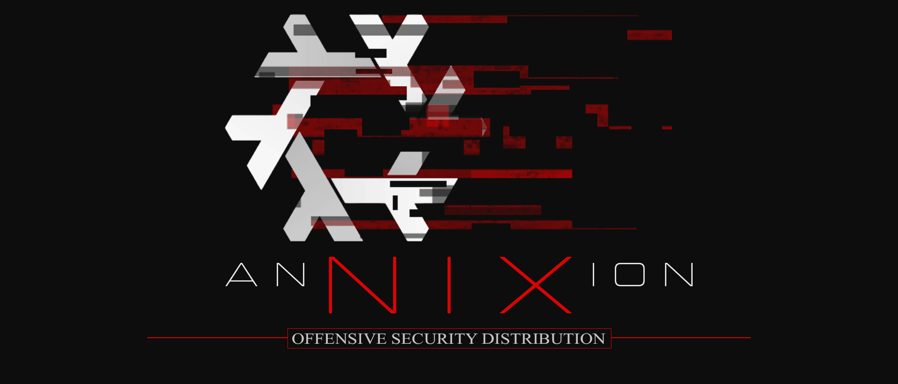

<div align="center">

# AnNIXion



**The environment for operators who refuse to wing it.**

[](https://github.com/Pyth3rEx/AnNIXion/releases/latest)
[](https://nixos.org)
[](https://nixos.wiki/wiki/Flakes)
[](https://github.com/Pyth3rEx/AnNIXion)
<br>
[](https://github.com/Pyth3rEx/AnNIXion/actions/workflows/ci.yml)
[](https://github.com/Pyth3rEx/AnNIXion/stargazers)
[](https://github.com/Pyth3rEx/AnNIXion/commits/main)
[](LICENSE)

[**Installation**](docs/installation.md) · [**Usage**](docs/usage.md) · [**Customization**](docs/customization.md) · [**Roadmap**](docs/roadmap.md)

</div>

---

AnNIXion is a NixOS-based offensive security distribution for red teamers, OSINT
practitioners, and persona operators. Every tool, browser profile, proxy rule and
desktop shortcut is declared in code — version-controlled, reproducible, deployed
in a single command.

The name comes from *annexion* — to take full control of a territory, absorb it
completely, make it yours.

---

## The problem

Your assessment box is the one machine you cannot afford to be unsure about, and
it is usually the least trustworthy thing you own.

Most security distributions are a package list dropped on a general-purpose OS.
You get the tools; you do not get the environment. Proxy settings drift. A
half-finished experiment lingers for months. The isolation you set up between
personas erodes one convenient exception at a time. Six months in, nobody —
including you — can say what that machine actually does, and the reinstall that
would settle it costs a day you do not have.

## The answer

**Declare the machine, don't maintain it.** AnNIXion is one Nix flake describing
the entire system: packages, browser profiles, egress policy, desktop layout,
shell. Deploying it is one command. Reproducing it on new hardware is the same
command. Undoing a bad change is a reboot into the previous generation.

|  | Traditional distro | AnNIXion |
|---|:---:|:---:|
| Configuration drift | Inevitable | Impossible |
| Reinstall | Hours of manual setup | One command |
| Browser isolation | Manual, breaks over time | Enforced by policy |
| Proxy kill-switch | None | Built in — leaks blocked by default |
| Burp CA setup | Manual every install | Auto-generated, trusted on first boot |
| Roll back a bad change | Not possible | Boot the previous generation |
| Share your exact setup | Zip file and prayer | `git clone` |

---

## What sets it apart

**Egress that fails closed.** The OSINT and Puppet Master profiles are confined
to your VPN tunnel by an nftables killswitch matched on a cgroup — not by browser
preferences that WebRTC, OCSP and captive-portal probes route straight around.
Tunnel drops, traffic stops. No fallback, no silent clearnet.

**Isolation you cannot erode.** Four Firefox profiles, each with its own cookies,
cache, extensions, search engines and egress path. They are generated from code,
so "just this once" is not a thing they can do.

**Interception that works on first boot.** Burp's CA is fetched and trusted
automatically. The Red Team profile proxies through Burp at the profile level,
and refuses to connect directly when Burp is down — a failed request beats an
unproxied one during an engagement.

**A machine that stays honest.** Attack surface reduction is a module you can
read, every setting one line to reverse. Hidden files are shown everywhere,
because an artefact you cannot see is one you cannot judge.

**Tested like software, not curated like a wallpaper.** Every push runs flake
evaluation, VM boot tests, tool-presence tests, killswitch regression tests, an
ISO build and a size gate.

---

## What's inside

<table>
<tr>
<td valign="top" width="50%">

**Browsers**
- Red Team — Burp proxy at profile level, FoxyProxy for ad-hoc switching, HackTools, Cookie Editor, SingleFile
- OSINT — VPN-enforced, NoScript, CanvasBlocker, UA Switcher, Cookie AutoDelete, Shodan and Censys search keywords
- Puppet Master — VPN-enforced, Multi-Account Containers, Temporary Containers, per-container identity stripe
- Unsafe Browser — clearnet fallback for captive portals, uBlock and fingerprint resistance only

**Proxy enforcement**
- Browsers block all traffic if their assigned proxy is not running
- Burp CA generated on first install — Firefox trusts it immediately
- Every proxy setting overridable per-machine via `user/`

</td>
<td valign="top" width="50%">

**Offensive tooling**
- Metasploit, Burp Suite, SQLMap, Gobuster, FFuf
- Nmap, Netcat, Wireshark, Hydra, Aircrack-ng
- John the Ripper, Hashcat
- Ghidra, Binwalk
- Volatility 3, Autopsy
- Impacket, WhatWeb

**OSINT & intelligence**
- theHarvester, WHOIS, dig/nslookup

**SDR / RF**
- HackRF tools, GQRX, GNURadio

**Desktop**
- KDE Plasma 6 (X11) with Krohnkite tiling
- Kill-chain application menu, from recon to forensics
- Hyper-V Enhanced Session over vsock
- ZSH + oh-my-posh, fzf history, syntax highlighting

</td>
</tr>
</table>

---

## Browser profiles

Every profile launches isolated — separate cookies, cache, extensions and proxy
rules. Click the desktop launcher. Nothing bleeds between them.

```
┌─────────────────────────────────────────────────────────────────┐
│  Firefox - Red Team          → Burp 127.0.0.1:8080              │
│  Firefox - OSINT             → VPN tunnel (kernel-enforced)     │
│  Firefox - Puppet Master     → VPN tunnel (kernel-enforced)     │
│  Firefox - Unsafe Browser    → Direct (clearnet, no proxy)      │
└─────────────────────────────────────────────────────────────────┘
  OSINT and Puppet Master are confined to the VPN tunnel by an nftables
  killswitch and refuse to launch without one. No fallback. No leaks.

  Red Team is not: it has to reach targets on the LAN as often as on the
  internet. Burp is its control, and still fails closed. Run it through
  the tunnel with  annixion-vpn-browser "Red Team"  when you want that.
```

---

## Quick start

**Fresh install — no NixOS required:**

1. Download the latest ISO from [Releases](https://github.com/Pyth3rEx/AnNIXion/releases/latest)
2. Flash to USB with [Rufus](https://rufus.ie) (Windows) or `dd` (Linux/macOS)
3. Boot — auto-logs in as `operator`
4. Connect: `nmtui`
5. Install: `annixion-install`

**On existing NixOS:**

```bash
git clone https://github.com/Pyth3rEx/AnNIXion ~/.dotfiles
cp /etc/nixos/hardware-configuration.nix ~/.dotfiles/
git -C ~/.dotfiles add hardware-configuration.nix -f
sudo nixos-rebuild switch --flake ~/.dotfiles#AnNIXion --impure
```

After the first build, use `rebuild`, `upgrade` or `update` from the shell.

Full guide including Hyper-V Enhanced Session setup →
[docs/installation.md](docs/installation.md)

---

## Documentation

| | |
|---|---|
| [Installation](docs/installation.md) | Prerequisites, deploy steps, Hyper-V setup, repository layout |
| [Usage](docs/usage.md) | Commands, browser profiles, Burp and VPN setup, override examples |
| [Customization](docs/customization.md) | User override system, adding tools, dev environment |
| [Shell reference](docs/zsh.md) | Prompt, keybindings, and the full alias and plugin list |
| [CLI tools](docs/tools.md) | Enhanced command-line tools (bat, rg, fd, fzf, jq…) |
| [Developer guide](docs/dev.md) | Local CI levels, VSCodium tasks, contributor workflow |
| [Hardening](docs/hardening.md) | What is disabled to reduce attack surface, and how to restore it |
| [FAQ](docs/faq.md) | Common setup and troubleshooting questions |
| [Roadmap](docs/roadmap.md) | Phase-by-phase progress, planned features |
| [Contributing](CONTRIBUTING.md) · [Security](SECURITY.md) | How to contribute · security posture and reporting |

---

## Status

Active development. Functional and deployable today.

`✔` Bootable ISO with guided installer (`annixion-install`)  
`✔` NixOS flake · Home Manager · plasma-manager  
`✔` KDE Plasma 6 · Krohnkite tiling · Breeze Dark  
`✔` Hyper-V Enhanced Session (vsock)  
`✔` Four Firefox profiles with proxy enforcement and Burp CA automation  
`✔` Kernel-level VPN killswitch with regression tests  
`✔` Offensive, OSINT and SDR tooling declared in a single module  
`✔` Attack surface reduction module  
`✔` ZSH + oh-my-posh environment  
`✔` User override system  
`✔` CI/CD — flake eval, VM tests, ISO build + size gate, versioned releases  

`○` Full disk encryption · TUI installer · Kernel hardening

See [docs/roadmap.md](docs/roadmap.md) for the full picture.

---

<div align="center">

**For authorized security testing, research, and educational use only.**  
Obtain explicit written permission before any assessment. The authors assume no
liability for misuse.

</div>
